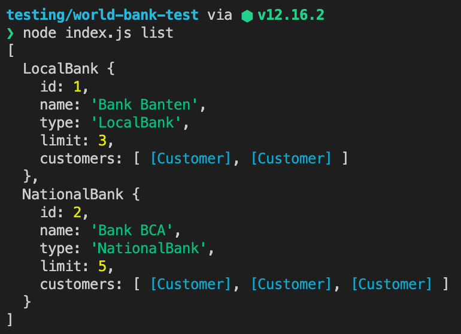
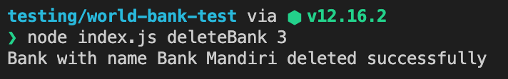
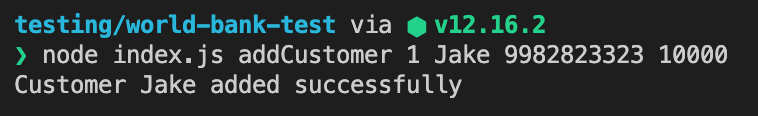
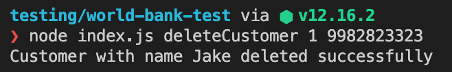
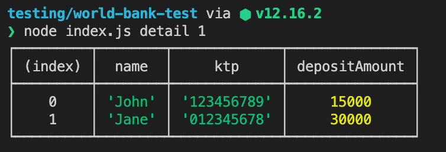
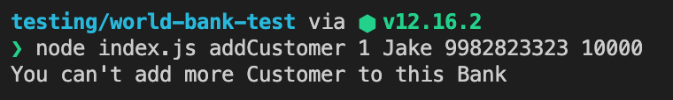
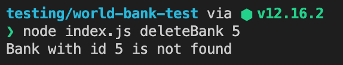
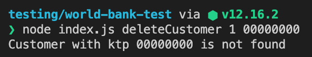

[](https://classroom.github.com/online_ide?assignment_repo_id=16658954&assignment_repo_type=AssignmentRepo)
# World Bank

> Duration 60 minutes (simulasi livecode)

Buat aplikasi yang menampilkan daftar `Bank` yang memiliki beberapa `Customer` dengan MVC Async.

**Note :**   
- Tidak boleh melakukan pengubahan terhadap `format keyname` pada data.json.
- Perlu diingat bahwa private property tidak dapat dibaca oleh JSON stringify sehingga kamu perlu melakukan adjusment.

## Release 0

Buatlah class `Bank` yang memiliki property:

- id = id dari sebuah `Bank`
- name = nama dari sebuah `Bank`
- type = jenis dari sebuah `Bank`
- limit = limit banyaknya `Customer` dari sebuah `Bank`
- customers = kumpulan instance `Customer`

Terdapat 2 jenis `Bank`:

- `LocalBank` = memiliki limit 3 `Customer`
- `NationalBank` = memiliki limit 5 `Customer`

Buatlah class `Customer` memiliki property:

- name = nama dari seorang `Customer`
- ktp = ktp dari seorang `Customer` (private)
- depositAmount = jumlah uang dari seorang `Customer` (private)

## Release 1

Buatlah fitur yang dapat menampilkan seluruh `Bank` beserta `Customer` berdasarkan data dari `data.json`

Note : gunakan Factory Method 

```cmd
node index.js list
```



## Release 2

Buatlah fitur yang dapat menambahkan `Bank` ke `data.json`. Buatlah id `Bank` auto-increment

```cmd
node index.js addBank <name> <type>
```

```cmd
node index.js addBank "Bank Mandiri" NationalBank
```


## Release 3

Buatlah fitur yang dapat menghapus `Bank` dari `data.json` berdasarkan id

```cmd
node index.js deleteBank <id>
```

```cmd
node index.js deleteBank 3
```



## Release 4

Buatlah fitur yang dapat menambahkan `Customer` ke sebuah `Bank` dan disimpan ke `data.json`

```cmd
node index.js addCustomer <idBank> <name> <ktp> <depositAmount>
```

```cmd
node index.js addCustomer 1 Jake 9982823323 10000
```



## Release 5

Buatlah fitur yang dapat menghapus `Customer` dari sebuah `Bank` berdasarkan id `Bank` dan ktp `Customer`, kemudian disimpan ke `data.json`

```cmd
node index.js deleteCustomer <idBank> <ktp>
```

```cmd
node index.js deleteCustomer 1 9982823323
```



## Release 6

Buatlah fitur yang dapat menampilkan seluruh `Customer` dari sebuah `Bank` berdasarkan id (gunakan `console.table` untuk mencetak table)

```cmd
node index.js detail <idBank>
```

```cmd
node index.js detail 1
```



## Release 7

1. Buatlah fitur validasi apabila melakukan addCustomer dan jumlah `Customer` terdaftar pada `Bank` tersebut sudah mencapai limit

   ```cmd
   node index.js addCustomer 1 Jake 9982823323 10000
   ```

   
2. Buatlah fitur validasi apabila melakukan deleteBank dengan id `Bank` yang tidak terdaftar

   ```cmd
   node index.js deleteBank 5
   ```

   
3. Buatlah fitur validasi apabila melakukan deleteCustomer dengan ktp yang tidak terdaftar

   ```cmd
   node index.js deleteCustomer 1 00000000
   ```

   

> Pada livecode akan ada requirement factory method, silahkan coba pada simulasi ini yaa.